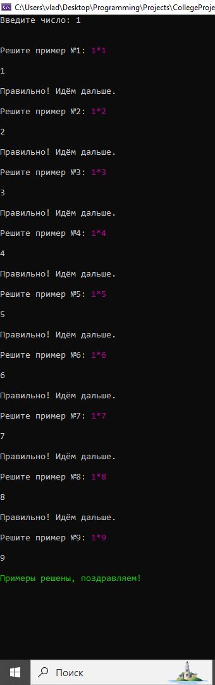

## Программа для решения примеров на умножение

### Описание

Программа предлагает пользователю решить серию из 9 примеров на умножение. В каждом примере задается произвольное число, которое умножается на константу от 1 до 9. 

### Функциональность

- Программа запрашивает у пользователя ввод произвольного числа.
- Генерирует 9 примеров на умножение, используя введенное пользователем число и константы.
- Проверяет правильность ответа пользователя на каждый пример.
- Выводит сообщение о правильном ответе или ошибке.
- При ошибочном ответе на любой из примеров, программа прекращает работу.
- После успешного решения всех 9 примеров, программа выводит поздравление.

### Использование

1. Запустите программу.
2. Введите произвольное число.
3. Решите предложенные примеры на умножение.
4. Введите свой ответ на каждый пример.
5. Программа проверит правильность ваших ответов и отобразит результат.

### Характеристики

- Программа написана на языке C++.
- Использует цветовое форматирование для выделения важной информации.
- Проста в использовании и легко адаптируется для изменения количества примеров.

### Дальнейшее развитие

- Можно добавить функцию генерации случайных чисел для констант, чтобы сделать примеры более разнообразными.
- Можно реализовать функцию подсчета количества ошибок пользователя.
- Можно добавить возможность выбора уровня сложности, изменяя количество примеров или диапазон констант.

### Пример

